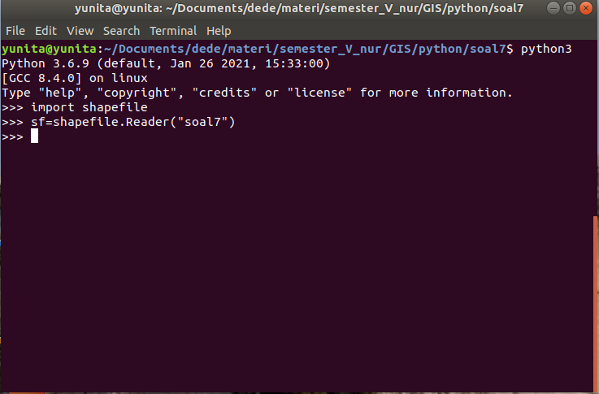
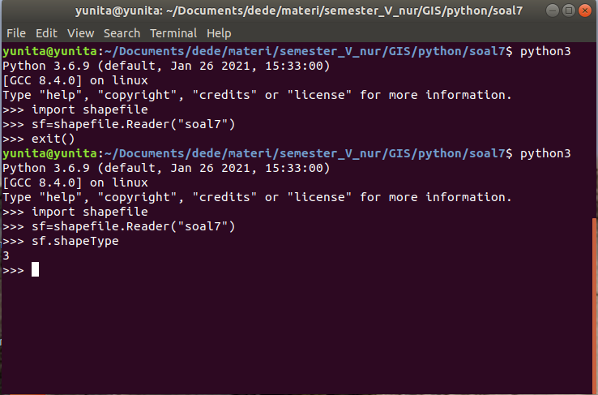
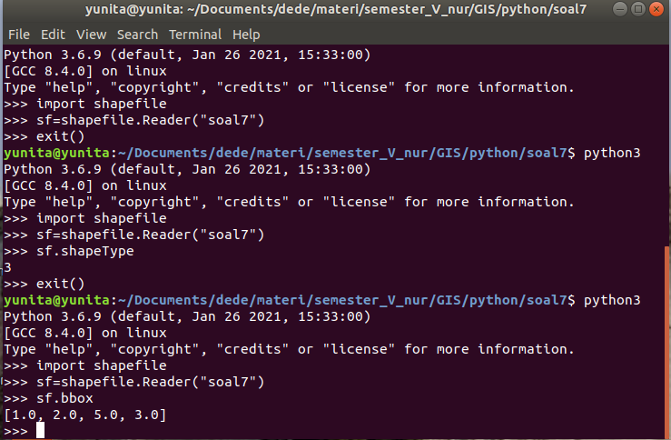
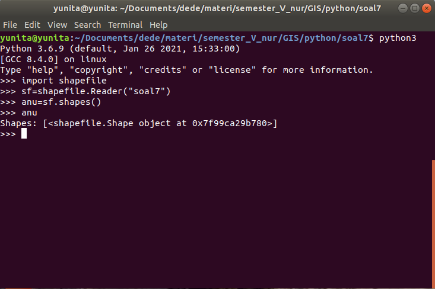
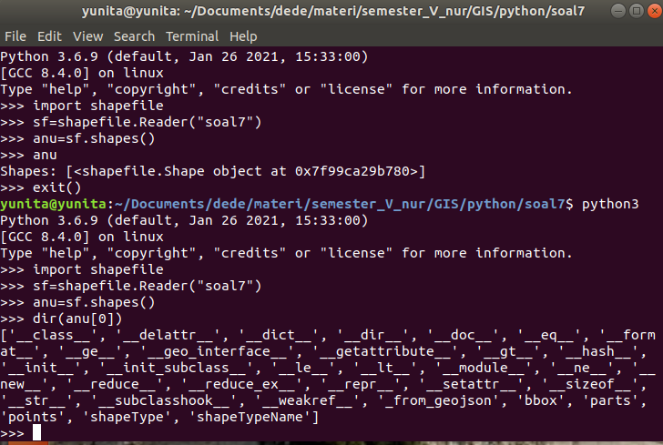
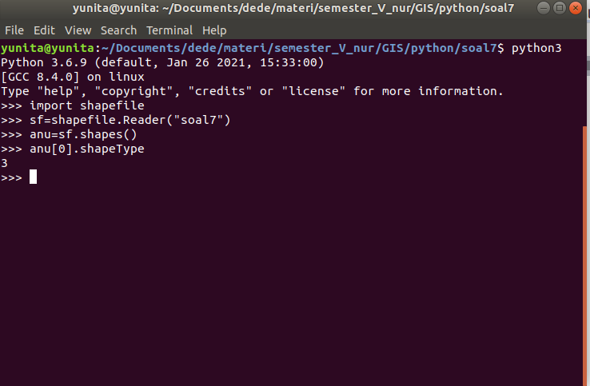
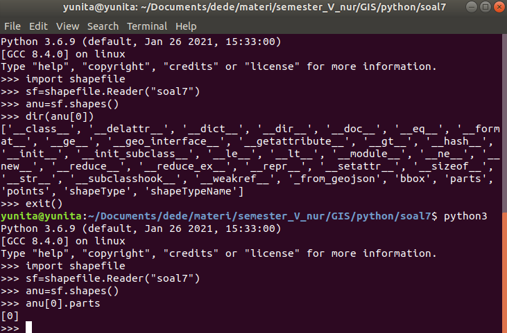
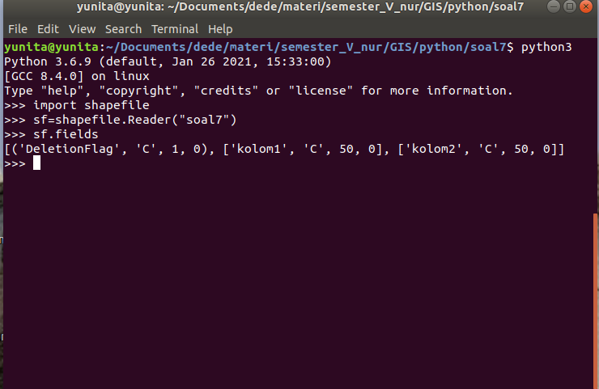
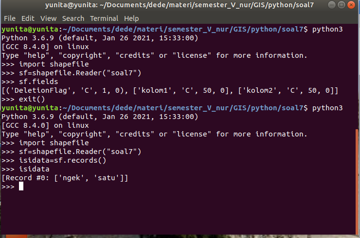
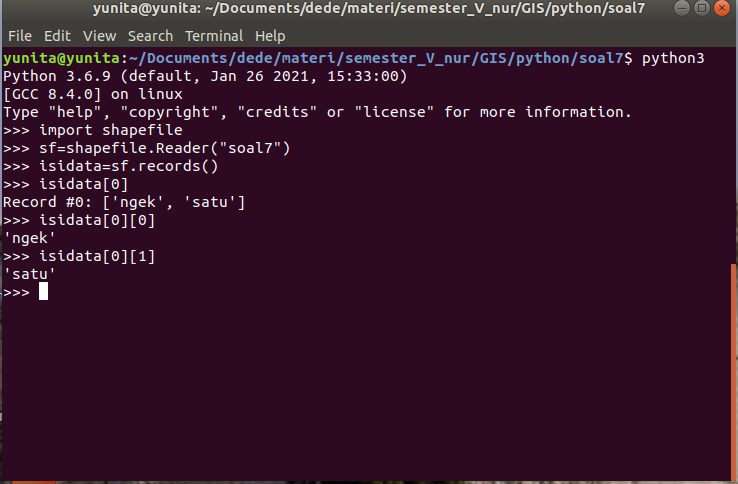

# GIS-Latihan1
Latihan sistem Informasi geografis1

Nama : Nur Ikhsani Suwandy Futri
NPM : 1194029
MOD : 8 = 5 dimana N adalah digit kedua NPM dari belakang  

# pyshp-latihan1
Ini merupakan kumpulan gambar dari soal 1-10 untuk memenuhi tugas Sistem Informasi Geografis menggunakan library pyshp serta QGIS.\
Tugas ini dibuat dengan mengandalkan [dokumentasi](https://pypi.org/project/pyshp/ "dokumentasi") dan tools sebagai berikut:
- Python v3.10.0
- QGIS v3.16.12
- pyshp v2.1.3

## Screenshot Latihan 2 soal 1 s/d 11
------------

### Soal 1

### Soal 2

### Soal 3

### Soal 4

### Soal 5

### Soal 6

### Soal 7

### Soal 8

### Soal 9

### Soal 10

### Soal 11

